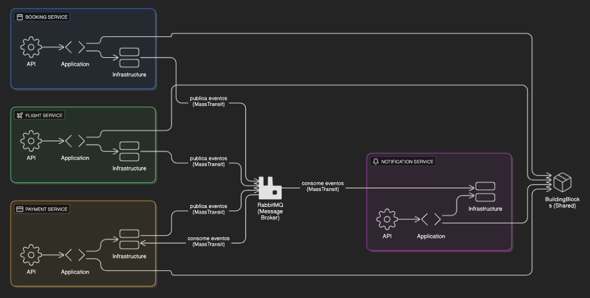

# AirlineBookingSystem - Arquitetura de Micro-serviços

## Resumo da Solução
A solução AirlineBookingSystem é composta por quatro micro-serviços independentes, desenvolvidos em .NET 8, que juntos implementam um sistema completo de reservas aéreas. Cada serviço é responsável por um domínio específico, promovendo escalabilidade, manutenção facilitada e integração desacoplada via mensageria assíncrona (RabbitMQ + MassTransit).

## Visão Geral

A solução AirlineBookingSystem é composta por quatro micro-serviços principais, cada um responsável por um domínio específico do sistema. Os serviços comunicam-se de forma assíncrona utilizando RabbitMQ como message broker, com MassTransit como middleware de mensageria. O padrão CQRS é aplicado para separar comandos e consultas, promovendo escalabilidade e organização.

## Diagrama Arquitetural

---

## Serviços, Tecnologias e Endpoints

### 1. AirlineBookingSystem.Booking.Api

- **Tecnologias Utilizadas:**
  - .NET 8 (ASP.NET Core)
  - MassTransit (RabbitMQ)
  - MediatR (CQRS)
  - StackExchange.Redis (Cache)
  - Swagger (Documentação)
  - BuildingBlocks (projeto compartilhado)

- **Infraestrutura:**
  - **MassTransit** para mensageria/eventos
  - **StackExchange.Redis** para cache distribuído
  - **RabbitMQ** como message broker

- **Principais Endpoints:**
  - `POST /api/bookings` — Criação de uma nova reserva
  - `GET /api/bookings/{id}` — Consulta de reserva por ID
  - `GET /api/bookings` — Listagem de reservas

- **Relacionamento:**
  - Publica eventos de reserva criada no RabbitMQ.
  - Consome eventos de notificações e pagamentos via MassTransit.
  - Utiliza BuildingBlocks para contratos e integrações comuns.

---

### 2. AirlineBookingSystem.Flight.Api

- **Tecnologias Utilizadas:**
  - .NET 8 (ASP.NET Core)
  - MassTransit (RabbitMQ)
  - MediatR (CQRS)
  - Swagger (Documentação)
  - BuildingBlocks (projeto compartilhado)

- **Infraestrutura:**
  - **MassTransit** para mensageria/eventos
  - **RabbitMQ** como message broker
  - **MongoDb** como banco de dados noSql

- **Principais Endpoints:**
  - `GET /api/flights` — Listagem de voos disponíveis
  - `GET /api/flights/{id}` — Consulta de voo por ID
  - `POST /api/flights` — Cadastro de novo voo

- **Relacionamento:**
  - Publica eventos de atualização de voos no RabbitMQ.
  - Pode consumir eventos de reservas para atualizar disponibilidade.
  - Utiliza BuildingBlocks para contratos e integrações comuns.

---

### 3. AirlineBookingSystem.Payment.Api

- **Tecnologias Utilizadas:**
  - .NET 8 (ASP.NET Core)
  - MassTransit (RabbitMQ)
  - MediatR (CQRS)
  - Swagger (Documentação)
  - BuildingBlocks (projeto compartilhado)

- **Infraestrutura:**
  - **MassTransit** para mensageria/eventos
  - **RabbitMQ** como message broker

- **Principais Endpoints:**
  - `POST /api/payments` — Processamento de pagamento
  - `GET /api/payments/{id}` — Consulta de pagamento por ID

- **Relacionamento:**
  - Consome eventos de reserva criada para iniciar o pagamento.
  - Publica eventos de pagamento processado no RabbitMQ.
  - Utiliza BuildingBlocks para contratos e integrações comuns.

---

### 4. AirlineBookingSystem.Notification.Api

- **Tecnologias Utilizadas:**
  - .NET 8 (ASP.NET Core)
  - MassTransit (RabbitMQ)
  - Dapper (Acesso a dados)
  - MediatR (CQRS)
  - Microsoft.Data.SqlClient (Acesso a banco SQL)
  - Swagger (Documentação)
  - BuildingBlocks (projeto compartilhado)

- **Infraestrutura:**
  - **MassTransit** para mensageria/eventos
  - **RabbitMQ** como message broker
  - **Dapper** para acesso a dados
  - **Microsoft.Data.SqlClient** para conexão com SQL Server

- **Principais Endpoints:**
  - `POST /api/notifications` — Envio de notificação
  - `GET /api/notifications/{id}` — Consulta de notificação por ID

- **Relacionamento:**
  - Consome eventos de pagamento processado para notificar usuários.
  - Publica eventos de notificação enviada no RabbitMQ.
  - Utiliza BuildingBlocks para contratos e integrações comuns.

---

## Integração e Comunicação

- **RabbitMQ** atua como barramento de eventos, promovendo comunicação desacoplada entre os serviços.
- **MassTransit** é utilizado para publicação e consumo de eventos, simplificando a integração.
- **CQRS** é aplicado em todos os serviços, separando comandos (escrita) e queries (leitura).
- **BuildingBlocks** centraliza contratos, eventos e utilitários compartilhados.

### Exemplo de Fluxo

1. O usuário cria uma reserva via Booking.Api.
2. Booking.Api publica um evento "ReservaCriada" no RabbitMQ.
3. Payment.Api consome o evento e processa o pagamento.
4. Após o pagamento, Payment.Api publica "PagamentoProcessado".
5. Notification.Api consome o evento e envia uma notificação ao usuário.

---

## Como Executar

1. Configure o RabbitMQ e o banco de dados conforme necessário.
2. Ajuste as strings de conexão em cada serviço.
3. Execute cada serviço individualmente:

```bash
dotnet run --project src/AirlineBookingSystem.Booking.Api 
dotnet run --project src/AirlineBookingSystem.Flight.Api 
dotnet run --project src/AirlineBookingSystem.Payment.Api 
dotnet run --project src/AirlineBookingSystem.Notification.Api
```

4. Acesse a documentação Swagger de cada serviço em `/swagger`.

---
